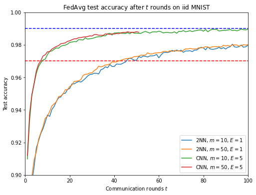
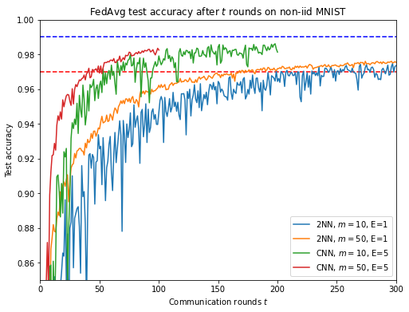

## PyTorch implementation of federated averaging (FedAvg) on MNIST

Paper: [_Communication-Efficient Learning of Deep Networks from Decentralized Data_](https://arxiv.org/abs/1602.05629) \[ICML'17\].

I reproduced some of the MNIST experiments from the seminial paper of McMahan et al., 2017.

To run experiments, see the notebook [fed_avg.ipynb](fed_avg.ipynb).

See [fed_avg.pdf](fed_avg.pdf) for full experimental details and results.

Below are plots of test accuracy after *t* rounds of FedAvg:

- for the iid and non-iid data setup;
- for a CNN vs a 2 hidden-layer MLP (2NN);
- for selecting *m*=10 or 50 clients each round.

 

*E* refers to the number of epochs for local training, for each client, for each round.
